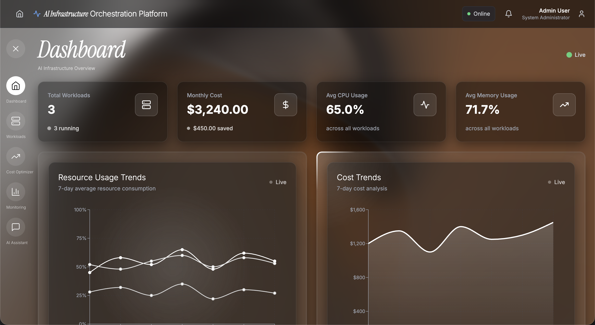
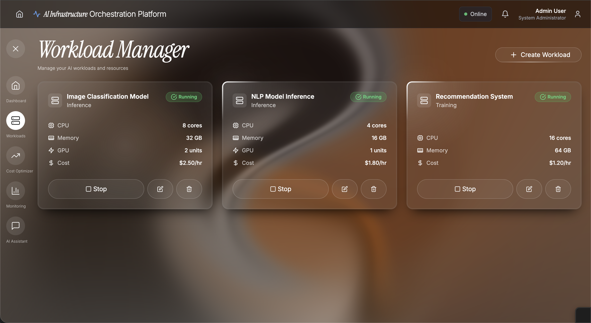
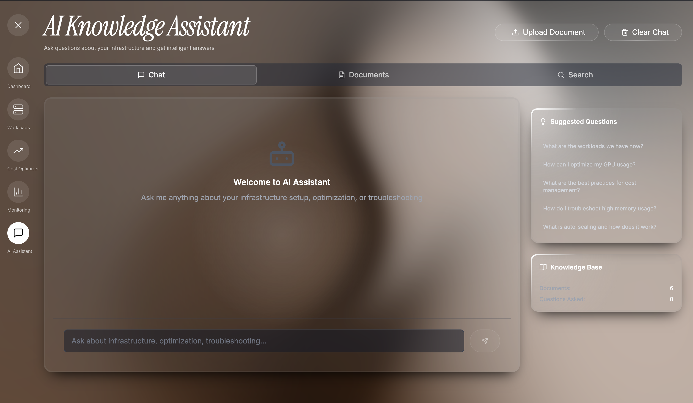
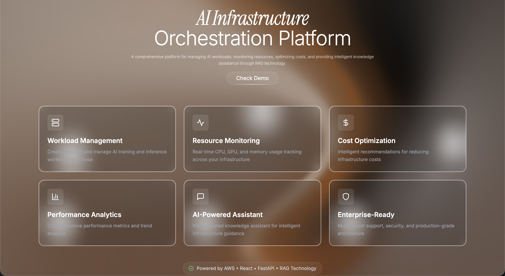

# AI Infrastructure Orchestration Platform

> A comprehensive platform for managing AI workloads, monitoring resources, optimizing costs, and providing intelligent knowledge assistance through RAG (Retrieval Augmented Generation) technology.

[](https://ai-infrastructure-with-rag.netlify.app/)
[](LICENSE)
[](https://app.netlify.com/sites/ai-infrastructure-with-rag)

## 🛠️ Tech Stack


## 🌐 Live Demo

**[👉 Try it live](https://ai-infrastructure-with-rag.netlify.app/)**

## 📸 Screenshots

<table>
  <tr>
    <td align="center">
      
      <br><strong>Dashboard Overview</strong>
    </td>
    <td align="center">
      
      <br><strong>Workload Manager</strong>
    </td>
    <td align="center">
      
      <br><strong>AI Knowledge Assistant</strong>
    </td>
  </tr>
  <tr>
    <td align="center">
      
      <br><strong>Landing Page</strong>
    </td>
    <td align="center">
      
      <br><strong>Platform Overview</strong>
    </td>
    <td align="center"></td>
  </tr>
</table>

## ✨ Features

### Core Infrastructure Management
- **Workload Management** - Create, monitor, and manage AI training and inference workloads
- **Resource Monitoring** - Real-time CPU, GPU, and memory usage tracking
- **Cost Optimization** - Intelligent recommendations for reducing infrastructure costs
- **Performance Analytics** - Comprehensive performance metrics and trend analysis

### AI-Powered Knowledge Assistant
- **RAG System** - Advanced Retrieval Augmented Generation for intelligent assistance
- **Document Search** - Search through technical documentation and best practices
- **Smart Recommendations** - AI-driven suggestions for infrastructure optimization
- **Contextual Help** - Get help based on your current workload and configuration

### Modern UI/UX
- **Futuristic Design** - Dark theme with glassmorphism effects and glowing elements
- **Interactive Dashboards** - Real-time data visualization with smooth animations
- **Responsive Layout** - Works perfectly on desktop, tablet, and mobile devices
- **Smooth Animations** - Framer Motion powered transitions and micro-interactions

### Enterprise-Ready Features
- **Resilient Architecture** - Automatic fallback to mock data when backend is unavailable
- **Multi-Tenant Support** - Built-in tenant isolation for enterprise deployments
- **Health Monitoring** - Backend health checks with automatic failover
- **Demo Mode** - Seamless portfolio demonstration with sample data
- **Production-Ready** - AWS-native services with always-on free tier support

## 🛠️ Tech Stack Details

**Frontend:**
- React 18 - Modern React with hooks and functional components
- Tailwind CSS - Utility-first CSS framework
- Framer Motion - Production-ready motion library
- Recharts - Composable charting library
- Axios - Promise-based HTTP client with automatic fallback

**Backend:**
- FastAPI - Modern Python web framework with async support
- Python 3.11+ - Backend development and scripts
- Pydantic - Data validation and settings management
- Mangum - ASGI adapter for AWS Lambda

**Database & Storage:**
- AWS DynamoDB - NoSQL database with always-on free tier
- AWS S3 - Document storage and file management
- AWS Cognito - User authentication and authorization

**AI & Search:**
- AWS Bedrock - LLM integration (Claude, Titan embeddings)
- Pinecone - Vector search for semantic document retrieval
- LangChain - RAG framework for AI-powered assistance

**Infrastructure:**
- AWS Lambda - Serverless function execution
- API Gateway - RESTful API endpoint management
- Netlify Functions - Alternative serverless backend (for demo)
- Terraform - Infrastructure as Code for AWS resources

**DevOps:**
- CloudWatch - Logging and monitoring
- AWS IAM - Security and access management

## 🚀 Quick Start

### Prerequisites

- Node.js 16+ and npm/yarn
- Python 3.11+ (for backend)
- Netlify account (for Netlify deployment) or AWS account (for AWS deployment)

### Installation

1. **Clone the repository**
   ```bash
   git clone https://github.com/ArivunidhiA/AI-Infrastructure-Orchestration-Platform---RAG.git
   cd AI-Infrastructure-Orchestration-Platform---RAG
   ```

2. **Install frontend dependencies**
   ```bash
   cd frontend
   npm install
   ```

3. **Install backend dependencies (optional, for local development)**
   ```bash
   cd backend
   python -m venv venv
   source venv/bin/activate  # On Windows: venv\Scripts\activate
   pip install -r requirements.txt
   ```

4. **Start development servers**

   **Option A: Frontend only (uses Netlify Functions or mock data)**
   ```bash
   cd frontend
   npm start
   ```

   **Option B: Full stack (Frontend + FastAPI backend)**
   ```bash
   # Terminal 1: Backend
   cd backend
   source venv/bin/activate
   python -m uvicorn main:app --reload

   # Terminal 2: Frontend
   cd frontend
   npm start
   ```

5. **Access the application**
   - Frontend: http://localhost:3000
   - Backend API: http://localhost:8000
   - API Docs: http://localhost:8000/api/docs
   - Health Check: http://localhost:8000/health

## 📁 Project Structure

```
AI-Infrastructure-Orchestration-Platform---RAG/
├── frontend/                    # React frontend application
│   ├── src/
│   │   ├── components/          # React components
│   │   │   ├── Dashboard.js
│   │   │   ├── WorkloadManager.js
│   │   │   ├── CostOptimizer.js
│   │   │   ├── RAGAssistant.js
│   │   │   └── DemoModeBanner.js
│   │   └── services/           # API services with fallback
│   │       ├── api.js
│   │       ├── health.js
│   │       └── mockData.js
│   └── package.json
├── backend/                     # FastAPI backend application
│   ├── main.py                 # FastAPI app entry point
│   ├── database.py             # DynamoDB client and tables
│   ├── config/
│   │   └── settings.py         # Environment configuration
│   ├── models/
│   │   └── dynamodb.py         # Pydantic data models
│   ├── routes/                 # API route handlers
│   │   ├── workloads.py
│   │   ├── monitoring.py
│   │   ├── optimization.py
│   │   ├── rag.py
│   │   └── auth.py
│   ├── services/               # Business logic services
│   │   ├── dynamodb_service.py
│   │   ├── s3_service.py
│   │   ├── vector_service.py
│   │   ├── llm_service.py
│   │   └── rag_service.py
│   ├── auth/                   # Authentication
│   │   ├── cognito.py
│   │   └── dependencies.py
│   └── utils/
│       └── logging.py         # CloudWatch logging
├── lambda/                     # AWS Lambda deployment
│   ├── handler.py              # Lambda entry point
│   └── requirements.txt
├── infrastructure/             # Terraform IaC
│   ├── main.tf
│   ├── variables.tf
│   └── outputs.tf
├── scripts/                    # Deployment scripts
│   ├── setup-aws.sh
│   └── deploy-lambda.sh
├── netlify/
│   └── functions/              # Netlify Functions (demo/fallback)
│       ├── workloads.js
│       ├── metrics.js
│       ├── optimization.js
│       └── rag.js
├── netlify.toml                # Netlify configuration
├── .env.example                # Environment variables template
├── DEPLOYMENT.md               # Deployment guide
├── AWS_SETUP.md                # AWS setup instructions
├── IMPLEMENTATION_SUMMARY.md   # Implementation details
└── README.md
```

## 🚀 Deployment

The platform supports multiple deployment strategies. Choose based on your needs:

### Option 1: Netlify (Easiest - No Credentials Required)

Perfect for portfolio demonstrations and quick deployments.

1. Connect your GitHub repository to [Netlify](https://netlify.com)
2. Configure build settings:
   - **Build command:** `cd frontend && npm install && npm run build`
   - **Publish directory:** `frontend/build`
   - **Base directory:** `.`
3. Deploy! Your app will be live automatically.
4. The frontend will use Netlify Functions or automatically fall back to mock data.

**Benefits:**
- ✅ No AWS account needed
- ✅ No API keys required
- ✅ Automatic fallback to mock data
- ✅ Perfect for portfolio demonstrations

### Option 2: AWS (Production-Ready)

Full-featured deployment with real database, authentication, and AI services.

**Prerequisites:**
- AWS account with credentials
- AWS CLI configured
- Terraform installed

**Quick Deploy:**
```bash
# 1. Set up AWS infrastructure
./scripts/setup-aws.sh

# 2. Deploy Lambda function
./scripts/deploy-lambda.sh

# 3. Update frontend API URL in Netlify
# Add environment variable: REACT_APP_API_URL = <API Gateway URL>
```

**Benefits:**
- ✅ Real database persistence (DynamoDB)
- ✅ User authentication (Cognito)
- ✅ Document storage (S3)
- ✅ Vector search (Pinecone)
- ✅ AI-powered responses (Bedrock)
- ✅ Always-on free tier services

See [DEPLOYMENT.md](DEPLOYMENT.md) for detailed AWS deployment instructions.

### Option 3: Hybrid (Frontend on Netlify, Backend on AWS)

Best of both worlds - easy frontend hosting with powerful backend.

1. Deploy backend to AWS (follow Option 2 steps 1-2)
2. Deploy frontend to Netlify
3. Set `REACT_APP_API_URL` environment variable in Netlify to your API Gateway URL

### Alternative Platforms

- **Vercel** - Works with minimal configuration (frontend only)
- **GitHub Pages** - Static hosting for frontend only
- **AWS S3 + CloudFront** - For enterprise deployments with CDN

## 🔧 Configuration

### Environment Variables

**Frontend:**
- `REACT_APP_API_URL` - API base URL (defaults to `/api` for Netlify, or set to AWS API Gateway URL)

**Backend (for AWS deployment):**
See `.env.example` for complete list. Key variables:
- `AWS_REGION` - AWS region (default: us-east-1)
- `AWS_ACCESS_KEY_ID` - AWS access key (optional if using IAM roles)
- `AWS_SECRET_ACCESS_KEY` - AWS secret key (optional if using IAM roles)
- `DYNAMODB_TABLE_PREFIX` - Table name prefix (default: ai-platform)
- `S3_DOCUMENTS_BUCKET` - S3 bucket for documents
- `COGNITO_USER_POOL_ID` - Cognito user pool ID
- `COGNITO_CLIENT_ID` - Cognito client ID
- `PINECONE_API_KEY` - Pinecone API key (optional, for vector search)
- `USE_BEDROCK` - Enable AWS Bedrock (optional, for real AI responses)

### Backend Architecture

**Netlify Functions** (`netlify/functions/`):
- Provides mock data for demonstration
- No credentials required
- Perfect for portfolio demonstrations
- Automatic fallback when backend unavailable

**FastAPI Backend** (`backend/`):
- Production-ready Python backend
- DynamoDB for data persistence
- AWS services integration
- Multi-tenant support
- Health checks and monitoring

**Resilience Features:**
- Automatic backend health detection
- Seamless fallback to mock data
- Demo mode banner for transparency
- Error handling and graceful degradation

## 📊 Key Capabilities

- **Real-time Metrics** - Live CPU, GPU, and memory usage tracking with historical trends
- **Performance Analytics** - Comprehensive performance metrics and trend visualization
- **Cost Optimization** - Intelligent recommendations for reducing infrastructure costs
- **Smart Alerts** - Automated notifications for resource usage and anomalies
- **Vector Search** - Semantic search using Pinecone or keyword fallback
- **Contextual Responses** - AI-generated responses using AWS Bedrock or template fallback
- **Document Management** - Upload, store, and search technical documentation
- **Multi-Tenant Support** - Built-in tenant isolation for enterprise deployments
- **Health Monitoring** - Backend health checks with automatic failover
- **Resilient Architecture** - Always functional, even when backend services are unavailable

## 🤝 Contributing

Contributions are welcome! Please follow these steps:

1. Fork the repository
2. Create a feature branch (`git checkout -b feature/amazing-feature`)
3. Commit your changes (`git commit -m 'Add amazing feature'`)
4. Push to the branch (`git push origin feature/amazing-feature`)
5. Open a Pull Request

## 📄 License

This project is licensed under the MIT License - see the [LICENSE](LICENSE) file for details.

## 📚 Documentation

- **[DEPLOYMENT.md](DEPLOYMENT.md)** - Complete deployment guide for AWS
- **[AWS_SETUP.md](AWS_SETUP.md)** - AWS account setup and service configuration
- **[IMPLEMENTATION_SUMMARY.md](IMPLEMENTATION_SUMMARY.md)** - Technical implementation details

## 🙏 Acknowledgments

- React team for the amazing framework
- FastAPI for the modern Python web framework
- Tailwind CSS for the utility-first approach
- Framer Motion for smooth animations
- AWS for comprehensive cloud services
- Netlify for excellent hosting and serverless functions
- Pinecone for vector search capabilities
- The open-source community for inspiration and tools

---

**Built with ❤️ for the AI Infrastructure community**
