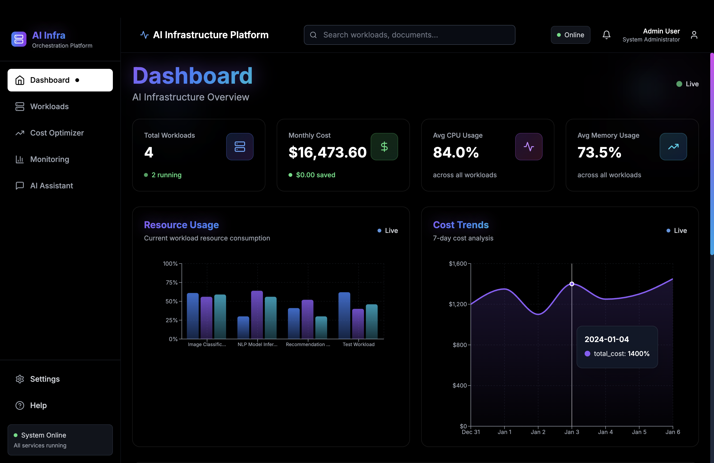
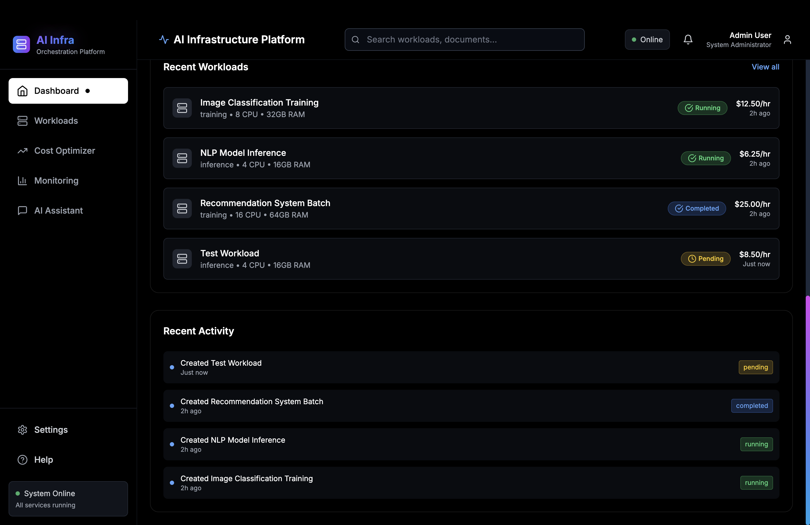
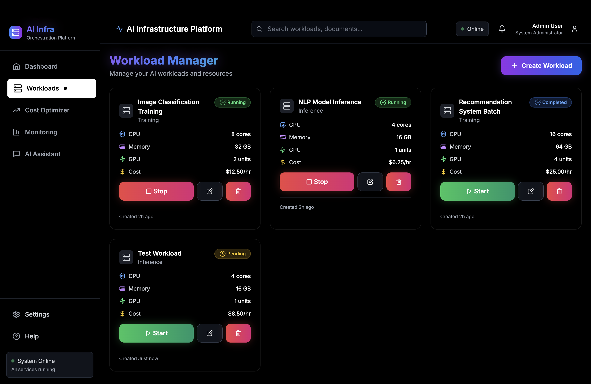
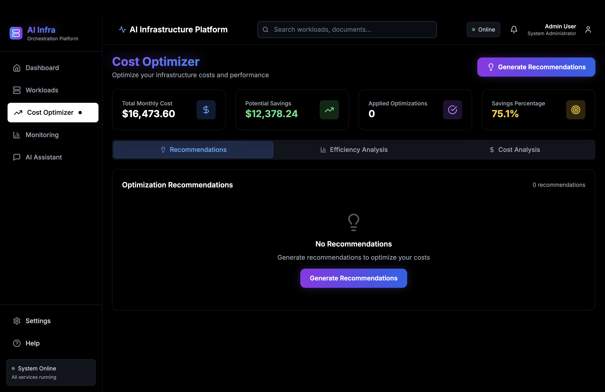
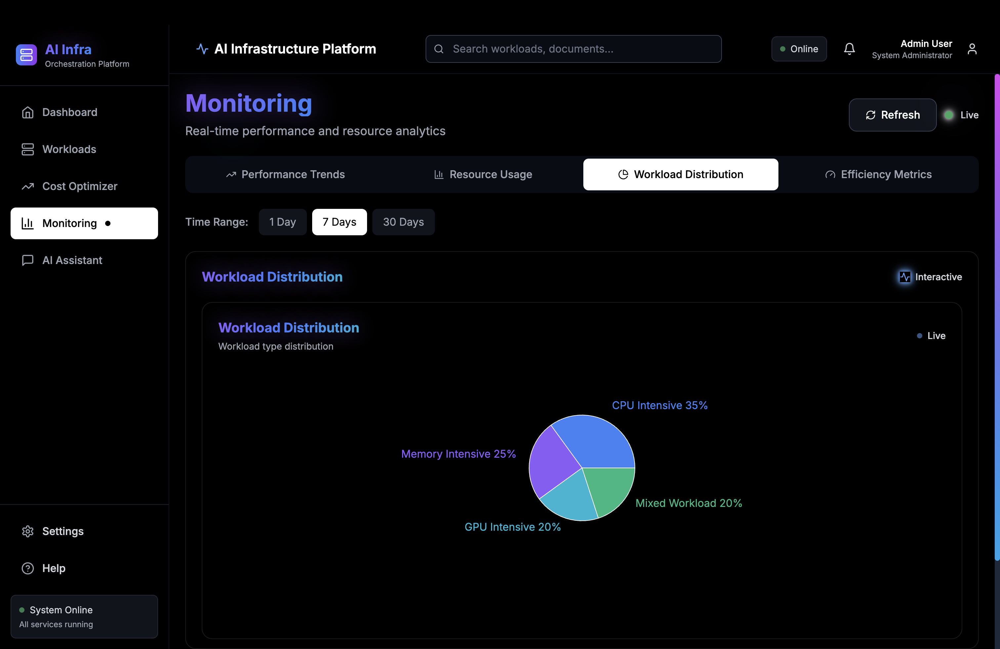
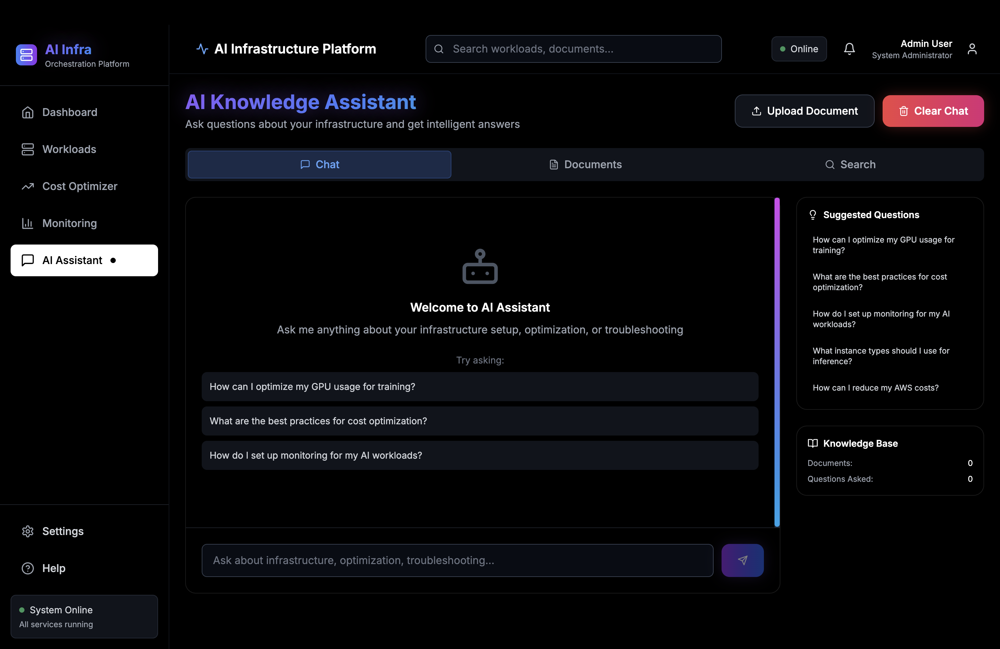

# AI Infrastructure Orchestration Platform








A comprehensive platform for managing AI workloads, monitoring resources, optimizing costs, and providing intelligent knowledge assistance through RAG (Retrieval Augmented Generation) technology.

## 🚀 Features

### Core Infrastructure Management
- **Workload Management**: Create, monitor, and manage AI training and inference workloads
- **Resource Monitoring**: Real-time CPU, GPU, and memory usage tracking
- **Cost Optimization**: Intelligent recommendations for reducing infrastructure costs
- **Performance Analytics**: Comprehensive performance metrics and trend analysis

### AI-Powered Knowledge Assistant
- **RAG System**: Upload infrastructure documentation and get intelligent answers
- **Semantic Search**: Find relevant information across your knowledge base
- **Smart Q&A**: Ask questions about setup, troubleshooting, and best practices
- **Document Management**: Upload and manage infrastructure guides and documentation

### Modern UI/UX
- **Futuristic Design**: Gradient themes with glow effects and smooth animations
- **Interactive Dashboard**: Real-time metrics and visualizations with enlarged charts
- **Responsive Layout**: Works seamlessly on desktop and mobile devices
- **Dark Theme**: Optimized for extended use with glassmorphism effects
- **Interactive Navigation**: Functional sidebar with settings and help modals
- **Smart Search**: Global search functionality across workloads and documents
- **User Management**: User profile dropdown with account settings
- **Notification System**: System alerts with improved visibility and opacity

## 🛠️ Tech Stack

### Backend
- **FastAPI**: High-performance Python web framework
- **SQLAlchemy**: Database ORM with SQLite
- **Pydantic**: Data validation and serialization
- **NumPy**: Numerical computations for RAG embeddings

### Frontend
- **React 18**: Modern React with hooks and functional components
- **Tailwind CSS**: Utility-first CSS framework
- **Recharts**: Beautiful and responsive charts
- **Lucide React**: Modern icon library
- **Framer Motion**: Smooth animations and transitions
- **React Hot Toast**: Elegant notifications and alerts
- **Axios**: HTTP client for API communication

### AI/ML Components
- **Mock OpenAI Embeddings**: Simulated embedding generation for RAG
- **Vector Similarity Search**: Cosine similarity for document retrieval
- **Document Processing**: Text chunking and preprocessing
- **Semantic Search**: Context-aware search capabilities

## 📁 Project Structure

```
ai-infrastructure-platform/
├── backend/
│   ├── main.py                 # FastAPI application entry point
│   ├── models.py               # SQLAlchemy database models
│   ├── database.py             # Database configuration and initialization
│   ├── requirements.txt        # Python dependencies
│   ├── routes/
│   │   ├── workloads.py        # Workload management endpoints
│   │   ├── monitoring.py       # Monitoring and metrics endpoints
│   │   ├── optimization.py     # Cost optimization endpoints
│   │   └── rag.py             # RAG system endpoints
│   └── services/
│       ├── resource_optimizer.py    # Resource optimization algorithms
│       ├── cost_calculator.py       # Cost calculation and analysis
│       ├── rag_engine.py            # RAG query processing
│       └── document_processor.py    # Document processing and chunking
├── frontend/
│   ├── src/
│   │   ├── components/
│   │   │   ├── Dashboard.js         # Main dashboard component
│   │   │   ├── WorkloadManager.js   # Workload management interface
│   │   │   ├── CostOptimizer.js     # Cost optimization interface
│   │   │   ├── MonitoringCharts.js  # Charts and visualizations
│   │   │   ├── RAGAssistant.js      # AI knowledge assistant
│   │   │   ├── Sidebar.js           # Navigation sidebar
│   │   │   └── Header.js            # Top navigation header
│   │   ├── services/
│   │   │   └── api.js               # API service layer
│   │   ├── App.js                   # Main React application
│   │   ├── index.js                 # React entry point
│   │   └── index.css                # Global styles and Tailwind
│   ├── public/
│   │   ├── index.html               # HTML template
│   │   └── manifest.json            # PWA manifest
│   ├── package.json                 # Node.js dependencies
│   └── tailwind.config.js           # Tailwind CSS configuration
└── README.md                        # This file
```

## 🚀 Quick Start

### Prerequisites
- Python 3.8+
- Node.js 16+
- npm or yarn

### Backend Setup

1. **Navigate to backend directory**:
   ```bash
   cd ai-infrastructure-platform/backend
   ```

2. **Create virtual environment**:
   ```bash
   python -m venv venv
   source venv/bin/activate  # On Windows: venv\Scripts\activate
   ```

3. **Install dependencies**:
   ```bash
   pip install -r requirements.txt
   ```

4. **Run the backend server**:
   ```bash
   python -m uvicorn main:app --reload --host 0.0.0.0 --port 8000
   ```

   The API will be available at `http://localhost:8000`
   - API Documentation: `http://localhost:8000/api/docs`
   - Alternative Docs: `http://localhost:8000/api/redoc`

### Frontend Setup

1. **Navigate to frontend directory**:
   ```bash
   cd ai-infrastructure-platform/frontend
   ```

2. **Install dependencies**:
   ```bash
   npm install
   ```

3. **Start the development server**:
   ```bash
   npm start
   ```

   The frontend will be available at `http://localhost:3000`

## 📊 API Documentation

### Workload Management

#### Create Workload
```http
POST /api/workloads
Content-Type: application/json

{
  "name": "Image Classification Training",
  "type": "training",
  "cpu_cores": 8,
  "gpu_count": 2,
  "memory_gb": 32.0,
  "cost_per_hour": 12.50
}
```

#### Get All Workloads
```http
GET /api/workloads?skip=0&limit=100
```

#### Get Workload Details
```http
GET /api/workloads/{workload_id}
```

#### Update Workload
```http
PUT /api/workloads/{workload_id}
Content-Type: application/json

{
  "name": "Updated Workload Name",
  "status": "running"
}
```

#### Delete Workload
```http
DELETE /api/workloads/{workload_id}
```

### Monitoring

#### Get Dashboard Statistics
```http
GET /api/monitoring/dashboard/stats
```

#### Get Workload Metrics
```http
GET /api/monitoring/metrics/{workload_id}?hours=24
```

#### Get Resource Usage Summary
```http
GET /api/monitoring/resource-usage
```

#### Get Performance Trends
```http
GET /api/monitoring/performance-trends?days=7
```

### Cost Optimization

#### Get Optimization Recommendations
```http
GET /api/optimization/recommendations?status_filter=pending&limit=50
```

#### Apply Optimization
```http
POST /api/optimization/apply/{recommendation_id}
```

#### Get Cost Analysis
```http
GET /api/optimization/cost-analysis
```

#### Get Efficiency Analysis
```http
GET /api/optimization/efficiency-analysis
```

### RAG System

#### Query Knowledge Base
```http
POST /api/rag/query
Content-Type: application/json

{
  "question": "How can I optimize my GPU usage for training?"
}
```

#### Upload Document
```http
POST /api/rag/docs/upload
Content-Type: multipart/form-data

file: [document file]
```

#### Search Documents
```http
GET /api/rag/search?query=optimization&limit=10
```

#### Get Query History
```http
GET /api/rag/history?limit=20&skip=0
```

## 🎨 UI Components

### Dashboard
- Real-time metrics overview
- Resource usage charts
- Recent activity feed
- System status indicators

### Workload Manager
- Create and manage AI workloads
- Resource configuration
- Status monitoring and controls
- Cost estimation

### Cost Optimizer
- Optimization recommendations
- Cost analysis and trends
- Efficiency metrics
- Savings tracking

### Monitoring Charts
- Interactive resource usage graphs
- Performance trend analysis
- Cost tracking visualizations
- Real-time data updates

### RAG Assistant
- Intelligent Q&A interface
- Document upload and management
- Semantic search capabilities
- Query history and suggestions

## 🔧 Configuration

### Environment Variables

Create a `.env` file in the backend directory:

```env
# Database
DATABASE_URL=sqlite:///./ai_infrastructure.db

# API Configuration
API_HOST=0.0.0.0
API_PORT=8000

# CORS Settings
CORS_ORIGINS=http://localhost:3000,http://localhost:3001

# RAG Configuration
EMBEDDING_DIM=1536
SIMILARITY_THRESHOLD=0.7
```

### Frontend Configuration

Update `src/services/api.js` to configure the API base URL:

```javascript
const api = axios.create({
  baseURL: process.env.REACT_APP_API_URL || 'http://localhost:8000',
  // ... other config
});
```

## 🚀 Deployment

### Single-Port Deployment (Recommended)

The platform supports single-port deployment where both frontend and backend run on the same port (8000):

1. **Build the frontend**:
   ```bash
   cd frontend
   npm run build
   ```

2. **Copy build files to backend**:
   ```bash
   cp -r build/* ../backend/static/
   ```

3. **Start the unified server**:
   ```bash
   cd backend
   python -m uvicorn main:app --reload --host 0.0.0.0 --port 8000
   ```

4. **Access the application**:
   - Frontend: `http://localhost:8000`
   - API: `http://localhost:8000/api/`
   - API Docs: `http://localhost:8000/api/docs`

### Netlify Deployment

1. **Build the frontend**:
   ```bash
   cd frontend
   npm run build
   ```

2. **Deploy to Netlify**:
   - Connect your GitHub repository to Netlify
   - Set build command: `cd frontend && npm run build`
   - Set publish directory: `frontend/build`
   - Deploy!

### Backend Deployment

The backend can be deployed to any Python hosting service:
- **Heroku**: Add a `Procfile` with `web: uvicorn main:app --host 0.0.0.0 --port $PORT`
- **Railway**: Deploy directly from GitHub
- **DigitalOcean App Platform**: Connect your repository

## 🧪 Sample Data

The platform comes with realistic sample data including:

- **Sample Workloads**: Image classification, NLP inference, batch processing
- **Performance Metrics**: Realistic CPU, GPU, and memory usage patterns
- **Cost Data**: Various pricing scenarios and optimization opportunities
- **Infrastructure Documentation**: AWS setup guides, troubleshooting tips, best practices

### Adding Sample Data

To populate the database with sample data, run:

```bash
cd backend
python add_sample_data.py
```

This script will create:
- 4 sample workloads with different statuses (running, completed, pending)
- Performance metrics for running workloads
- Optimization recommendations
- Realistic resource usage data

## 🔍 Key Features Explained

### RAG System
The RAG (Retrieval Augmented Generation) system provides intelligent answers by:
1. Processing uploaded documents and generating embeddings
2. Using semantic search to find relevant information
3. Generating contextual answers based on retrieved content
4. Providing confidence scores and source citations

### Cost Optimization
The platform analyzes workloads and provides recommendations for:
- Right-sizing instances based on actual usage
- Switching to spot instances for cost savings
- Implementing auto-scaling policies
- Identifying idle resources

### Resource Monitoring
Real-time monitoring includes:
- CPU, GPU, and memory utilization tracking
- Cost accumulation over time
- Performance trend analysis
- Alert generation for anomalies

### Modern UI/UX Features
The platform features a sophisticated user interface with:
- **Framer Motion Animations**: Smooth page transitions and element animations
- **Glassmorphism Design**: Translucent cards with backdrop blur effects
- **Interactive Charts**: Enlarged, responsive charts with horizontal labels
- **Functional Navigation**: Working search, user menu, settings, and help modals
- **Real-time Updates**: Live indicators and dynamic data visualization
- **Responsive Design**: Optimized for all screen sizes

## 🤝 Contributing

1. Fork the repository
2. Create a feature branch: `git checkout -b feature/amazing-feature`
3. Commit your changes: `git commit -m 'Add amazing feature'`
4. Push to the branch: `git push origin feature/amazing-feature`
5. Open a Pull Request

## 📝 License

This project is licensed under the MIT License - see the [LICENSE](LICENSE) file for details.

## 🙏 Acknowledgments

- FastAPI for the excellent Python web framework
- React and Tailwind CSS for the modern frontend
- Recharts for beautiful data visualizations
- The open-source community for inspiration and tools

## 📞 Support

For support, email support@aiinfraplatform.com or create an issue in the GitHub repository.

---

**Built with ❤️ for the AI infrastructure community**
